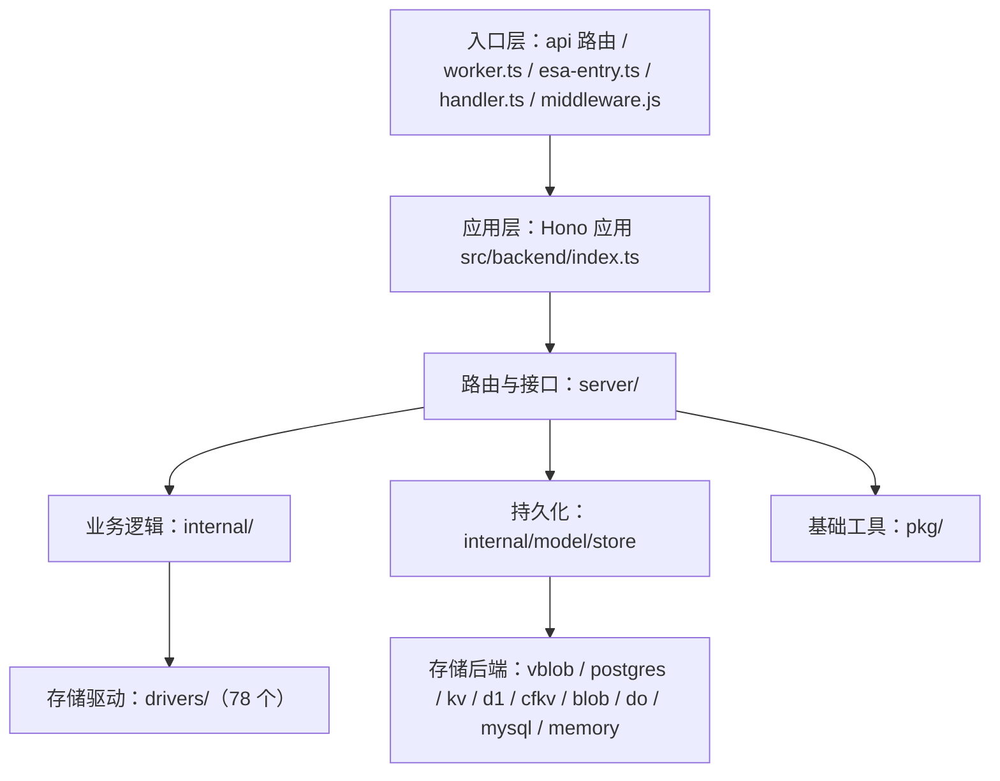

<div align="center">
  

  <p><em>Storlane 是一个多功能的目录列表工具，支持数十种网盘文件挂载和文件预览/下载/分享等功能</em></p>
  <p>基于官方 <a href="https://github.com/OpenListTeam/OpenList">OpenListTeam/OpenList</a> 的 TypeScript + Serverless 移植版再品牌化而来</p>
  <p>基于 Cloudflare Workers / EdgeOne Cloud Function / Alibaba Cloud ESA / Vercel Serverless 运行</p>

<a href="https://github.com/jinzhenyi/Storlane/blob/main/LICENSE"></a>
<a href="https://github.com/jinzhenyi/Storlane/actions/workflows/edgeone-artifact-guard.yml"></a>
<a href="https://github.com/jinzhenyi/Storlane/releases"></a>
<a href="https://github.com/jinzhenyi/Storlane/discussions"></a>
<a href="https://github.com/jinzhenyi/Storlane/releases"></a>

</div>

<div align="center">

[上游项目](https://github.com/OpenListTeam/OpenList) · [贡献指南](https://github.com/jinzhenyi/Storlane/blob/main/CONTRIBUTING.md) · [行为准则](https://github.com/jinzhenyi/Storlane/blob/main/CODE_OF_CONDUCT.md) · [许可证](./LICENSE)

</div>

---

## 项目介绍

Storlane 是一个多存储聚合的文件列表与管理系统：把分散在不同网盘、对象存储和协议服务中的文件，统一到一个界面中浏览、预览、下载和管理。

本仓库基于官方 [OpenListTeam/OpenList](https://github.com/OpenListTeam/OpenList)（Go 版）的 **TypeScript + Serverless 移植版**（包名 `storlane`，版本 `4.2.3`）再品牌化而来。其核心差异在于：

- **后端由 Go 重写为 TypeScript**，运行在边缘计算与 Serverless 运行时上，而不是传统常驻进程；
- **前端保持与官方一致的界面与交互**，复用官方前端产物；
- **同一套后端代码可部署到多个平台**：Cloudflare Workers、腾讯云 EdgeOne Makers、阿里云 ESA、Vercel Serverless，以及 Node.js 容器环境。

目标是让「聚合几十种网盘」这件事尽可能零运维：无需自己维护服务器、进程与反向代理。

### 设计目标

- **边缘优先、无服务器**：以请求驱动的方式运行，天然适应冷启动、多实例并发。
- **一套代码、多平台**：抽象出统一入口与存储适配层，部署形态由环境决定。
- **数据可移植**：提供多种存储格式，其中关系表格式与 Go 后端完全同构，可与 Go 版共享同一物理数据库。
- **显式优于隐式**：显式指定的驱动/格式若不可用，直接报错并给出可操作原因，不静默回退到其它后端，避免「以为在用 A、实际写进了 B」。
- **安全默认**：JWT 会话、CSRF 防护、点击劫持防护、内容安全策略，以及可插拔的敏感字段落盘加密。

### 整体架构



- **入口层**：`api/[...route].ts`（Vercel / EdgeOne Node Serverless）、`src/backend/worker.ts`（Cloudflare Workers）、`esa-entry.ts`（阿里云 ESA）、`handler.ts`（通用 Serverless / Node）、根级 `middleware.js`（EdgeOne 边缘中间件），最终都收敛到同一个 Hono 应用。
- **应用层**：`src/backend/index.ts` 装配 Hono、合并运行时环境变量、挂载全部后端路由，并提供 SPA 回退壳，保证前端深链可用。
- **路由与接口层**（`src/backend/server/`）：按领域拆分的 HTTP 接口与中间件，涵盖鉴权与账户（`auth` / `sso` / `ldap` / `public`）、文件与共享（`fs` / `raw` / `share` / `task`）、管理（`admin`）、对外协议（`webdav` / `s3` / `mcp`）、代理与静态资源（`proxy_request` / `assets`）等。
- **业务内部层**（`src/backend/internal/`）：与 HTTP 无关的领域逻辑，包括 `driver`、`model`、`op`、`stream`、`upload`、`webdav`、`mcp`、`archive`、`seed`。
- **基础工具层**（`src/backend/pkg/`）：`crypto` / `legacy-ciphers` / `chacha20`、`csrf`、`totp`、`password`、`permission`、`path`、`sign`、`xml`、`stream`、`http`、`errs`、`audit`、`secure-log` 等。

### 存储与持久化

- **存储格式（`DB_FORMAT`）**：`map`（整对象 JSON，适合 KV / Blob）、`key`（按实体拆分为多条记录）、`sql`（关系表，表结构与命名与 Go 后端一致，如 `x_storages` / `x_users`，可与 Go 版共享数据库）。
- **存储驱动（`DB_DRIVER`）**：EdgeOne Blob、ESA Blob、Vercel Blob（`vblob`）、Cloudflare KV（binding 与 REST API）、Cloudflare D1、Cloudflare Durable Objects、MySQL / MariaDB、PostgreSQL（含 Vercel Marketplace / Neon 的 HTTP 驱动），以及仅用于降级的 memory。默认 `auto` 按固定优先级探测；显式指定驱动时不回退。
- **敏感字段加密（`DB_CIPHER`）**：默认 `none`，可启用 AES-256-GCM、ChaCha20-Poly1305、AES-CBC-HMAC 等。密文带版本前缀（`enc:v1:` ~ `enc:v6:`），读取时按前缀自动识别算法，因此切换算法或关闭加密都不会使既有数据不可读，并在下次保存时逐字段迁移。

### 存储驱动生态

内置 **78 个存储驱动**，覆盖主流网盘、对象存储、协议服务与网盘程序；另提供 `Local`、`Alias`、`UrlTree`、`AutoIndex`、`Strm`、`Crypt`、`Virtual`、`Chunk` 等虚拟 / 功能型驱动。驱动之间通过统一接口对接上层文件操作，新增驱动只需实现该接口并登记到注册表。

### 核心能力

- **文件浏览与预览**：统一目录树，支持图片、视频、音频、文档、代码、压缩包等在线预览。
- **上传与下载**：跨存储上传、批量下载、流式传输与直链跳转。
- **文件分享**：带有效期、密码与权限控制的分享链接，支持匿名访问与目录分享。
- **搜索**：在已索引存储中检索文件。
- **离线任务**：后台任务队列，支持批量与异步处理。
- **对外协议**：`WebDAV` 与 S3 兼容端点，便于挂载到第三方工具。
- **MCP 服务**：提供 Model Context Protocol 端点，可被 AI 助手等客户端集成。

### 权限与安全

- **访问控制**：基于角色的 RBAC，支持用户分组、目录级读写权限与配额。
- **认证方式**：内置账号密码，支持 TOTP 二次验证、WebAuthn/FIDO 登录、SSO 单点登录与 LDAP 目录认证。
- **加固项**：JWT 会话、CSRF 防护、点击劫持防护（`X-Frame-Options`）、内容安全策略（CSP）。
- **可观测性**：`/health` 存活探针与 `/healthz` 就绪探针；就绪探针基于实际生效的存储驱动判断持久化是否可用。

### 前端

- **框架**：React 19 + TypeScript；**UI**：Ant Design / Material-UI；**构建**：Vite。
- **形态**：单页应用，配合后端 SPA 回退，保证前端路由深链可用。

### 多平台部署形态

后端不绑定单一平台，同一套代码以不同入口适配多种运行环境：Cloudflare Workers（原生 `fetch`，使用 D1 / KV 等绑定）、腾讯云 EdgeOne Makers（Node Serverless + 根级边缘中间件）、阿里云 ESA（专用入口）、Vercel Serverless（Node Runtime，使用平台自带 Blob / Postgres 持久化）、以及 Serverless / Node.js 容器。

---

## 如何修改

### 目录结构

- `src/backend/server/`：HTTP 路由与中间件（鉴权、文件、分享、管理、WebDAV / S3 / MCP 等）。
- `src/backend/drivers/`：78 个存储驱动，每个驱动一个子目录。
- `src/backend/internal/`：领域逻辑与存储层（`model/store` 为持久化抽象、格式与后端驱动）。
- `src/backend/pkg/`：加密、签名、权限、路径、XML、流等基础工具。
- `api/`、`src/backend/worker.ts`、`esa-entry.ts`、`handler.ts`：各平台入口。
- `scripts/`：构建与部署脚本。

### 常用命令

```bash
# 安装依赖
pnpm install

# 本地开发：拉取官方前端并启动 Worker
pnpm run dev:unified

# 仅运行后端 Worker（不拉取前端）
pnpm run dev:worker

# 类型检查
pnpm lint

# 分模块测试
pnpm run test:drivers
pnpm run test:server
pnpm run test:store
pnpm run test:model
```

### 修改代码后如何构建

```bash
# 拉取官方前端并产出各平台构建产物
pnpm build
```

`pnpm build` 由两个脚本组成：`scripts/fetch-frontend.mjs`（拉取官方前端）与 `scripts/build-edge.mjs`（产出各平台所需产物）。若部署到 Vercel，还需在部署前额外执行 `node scripts/vercel-bundle.mjs` 打包并注入函数入口。

### 推送到自己的仓库

```bash
# 添加上游与你自己的远端
git remote add jinzhenyi https://github.com/<你的用户名>/Storlane.git

# 提交改动并推送
git add .
git commit -m "feat: your change"
git push jinzhenyi main
```

推送后，若项目已与 Vercel / Cloudflare 等平台绑定 Git 集成，平台会自动构建部署；也可用各平台 CLI 发布，Vercel 的预构建流程为：

```bash
vercel build --prod
node scripts/vercel-bundle.mjs
vercel deploy --prebuilt --prod
```

### 修改站点配置

运行配置通过环境变量提供，示例与说明见 [`.env.example`](./.env.example)。常用项：

- `DB_DRIVER` / `DB_FORMAT`：存储驱动与格式（如 `vblob` + `map`、`postgres` + `sql`）。
- `DB_CIPHER`：敏感字段落盘加密算法（默认 `none`，推荐 `aes-256-gcm`）。
- `JWT_SECRET`：会话签名密钥，同时作为字段加密的密钥派生材料；启用加密后请勿随意更换。
- `CRON_SECRET`：定时任务端点鉴权密钥。

> 注意：加密密钥由 `JWT_SECRET` 派生。启用 `DB_CIPHER` 后若更换 `JWT_SECRET`，已加密字段将无法解密；如需更换，先设 `DB_CIPHER=none` 并保存一次完成明文迁移。

---

## 开源许可

`Storlane` 是基于 [AGPL-3.0](https://www.gnu.org/licenses/agpl-3.0.txt) 许可证的开源软件，源自并以修改形式使用 `OpenList` / `Alist` 项目。依据许可证要求，本仓库保留 `LICENSE` 与上游版权声明，并在此说明本项目为上游项目的修改版本。

## 贡献列表

感谢以下项目及其贡献者：

- [Alist](https://github.com/AlistGo/alist) 项目作者及全体贡献者
- [OpenList](https://github.com/OpenListTeam/OpenList)（Go 版）项目作者及全体贡献者
- 本项目（Storlane）全体贡献者：

[](https://github.com/jinzhenyi/OpenList-Worker/graphs/contributors)
