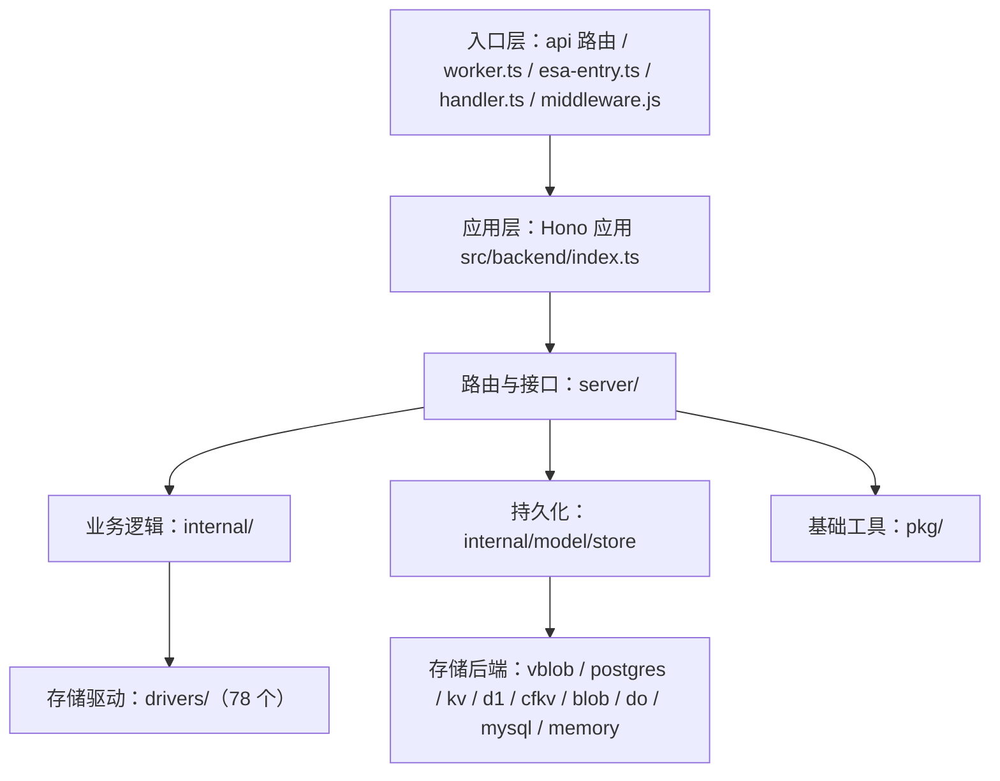

<div align="center">
  

  <p><em>OpenList 是一个多功能的目录列表工具，支持数十种网盘文件挂载和文件预览/下载/分享等功能</em></p>
  <p>本仓库是官方 <a href="https://github.com/OpenListTeam/OpenList">OpenListTeam/OpenList</a> 项目的 TypeScript + Serverless 架构移植版</p>
  <p>基于 Cloudflare Workers / EdgeOne Cloud Function / Alibaba Cloud ESA / Vercel Serverless 运行</p>

<a href="https://github.com/OpenListTeam/OpenList-Worker/blob/main/LICENSE"></a>
<a href="https://github.com/OpenListTeam/OpenList-Worker/actions/workflows/edgeone-artifact-guard.yml"></a>
<a href="https://github.com/OpenListTeam/OpenList-Worker/releases"></a>
<a href="https://github.com/OpenListTeam/OpenList-Worker/discussions"></a>
<a href="https://github.com/OpenListTeam/OpenList-Worker/releases"></a>

</div>

<div align="center">

[English](readmes/README_en.md) | 简体中文 | [繁體中文](readmes/README_zh-TW.md) | [日本語](readmes/README_ja.md) | [한국어](readmes/README_ko.md) | [Français](readmes/README_fr.md) | [Deutsch](readmes/README_de.md) 

[Português](readmes/README_pt.md) | [Русский](readmes/README_ru.md) | [العربية](readmes/README_ar.md) | [Italiano](readmes/README_it.md) | [हिन्दी](readmes/README_hi.md) | [Español](readmes/README_es.md)

[上游项目](https://github.com/OpenListTeam/OpenList) · [贡献指南](https://github.com/OpenListTeam/OpenList-Worker/blob/main/CONTRIBUTING.md) · [行为准则](https://github.com/OpenListTeam/OpenList-Worker/blob/main/CODE_OF_CONDUCT.md) · [许可证](./LICENSE)

</div>

---

## 项目介绍

OpenList 是一个多存储聚合的文件列表与管理系统：把分散在不同网盘、对象存储和协议服务中的文件，统一到一个界面中浏览、预览、下载和管理。

本仓库是官方 [OpenListTeam/OpenList](https://github.com/OpenListTeam/OpenList)（Go 版）的 **TypeScript + Serverless 移植版**（包名 `openlist`，版本 `4.2.3`）。其核心差异在于：

- **后端由 Go 重写为 TypeScript**，运行在边缘计算与 Serverless 运行时上，而不是传统常驻进程；
- **前端保持与官方一致的界面与交互**，复用官方前端产物；
- **同一套后端代码可部署到多个平台**：Cloudflare Workers、腾讯云 EdgeOne Makers、阿里云 ESA、Vercel Serverless，以及 Node.js 容器环境。

目标是让「聚合几十种网盘」这件事尽可能零运维：无需自己维护服务器、进程与反向代理。

### 设计目标

- **边缘优先、无服务器**：以请求驱动的方式运行，天然适应冷启动、多实例并发。
- **一套代码、多平台**：抽象出统一入口与存储适配层，部署形态由环境决定。
- **数据可移植**：提供多种存储格式，其中关系表格式与 Go 后端完全同构，可与 Go 版共享同一物理数据库。
- **显式优于隐式**：显式指定的驱动/格式若不可用，直接报错并给出可操作原因，不静默回退到其它后端，避免「以为在用 A、实际写进了 B」。
- **安全默认**：JWT 会话、CSRF 防护、点击劫持防护、内容安全策略，以及可插拔的敏感字段落盘加密。

### 整体架构



- **入口层**：`api/[...route].ts`（Vercel / EdgeOne Node Serverless）、`src/backend/worker.ts`（Cloudflare Workers）、`esa-entry.ts`（阿里云 ESA）、`handler.ts`（通用 Serverless / Node）、根级 `middleware.js`（EdgeOne 边缘中间件），最终都收敛到同一个 Hono 应用。
- **应用层**：`src/backend/index.ts` 装配 Hono、合并运行时环境变量、挂载全部后端路由，并提供 SPA 回退壳，保证前端深链可用。
- **路由与接口层**（`src/backend/server/`）：按领域拆分的 HTTP 接口与中间件，涵盖鉴权与账户（`auth` / `sso` / `ldap` / `public`）、文件与共享（`fs` / `raw` / `share` / `task`）、管理（`admin`）、对外协议（`webdav` / `s3` / `mcp`）、代理与静态资源（`proxy_request` / `assets`）等。
- **业务内部层**（`src/backend/internal/`）：与 HTTP 无关的领域逻辑，包括 `driver`、`model`、`op`、`stream`、`upload`、`webdav`、`mcp`、`archive`、`seed`。
- **基础工具层**（`src/backend/pkg/`）：`crypto` / `legacy-ciphers` / `chacha20`、`csrf`、`totp`、`password`、`permission`、`path`、`sign`、`xml`、`stream`、`http`、`errs`、`audit`、`secure-log` 等。

### 存储与持久化

- **存储格式（`DB_FORMAT`）**：`map`（整对象 JSON，适合 KV / Blob）、`key`（按实体拆分为多条记录）、`sql`（关系表，表结构与命名与 Go 后端一致，如 `x_storages` / `x_users`，可与 Go 版共享数据库）。
- **存储驱动（`DB_DRIVER`）**：EdgeOne Blob、ESA Blob、Vercel Blob（`vblob`）、Cloudflare KV（binding 与 REST API）、Cloudflare D1、Cloudflare Durable Objects、MySQL / MariaDB、PostgreSQL（含 Vercel Marketplace / Neon 的 HTTP 驱动），以及仅用于降级的 memory。默认 `auto` 按固定优先级探测；显式指定驱动时不回退。
- **敏感字段加密（`DB_CIPHER`）**：默认 `none`，可启用 AES-256-GCM、ChaCha20-Poly1305、AES-CBC-HMAC 等。密文带版本前缀（`enc:v1:` ~ `enc:v6:`），读取时按前缀自动识别算法，因此切换算法或关闭加密都不会使既有数据不可读，并在下次保存时逐字段迁移。

### 存储驱动生态

内置 **78 个存储驱动**，覆盖主流网盘、对象存储、协议服务与网盘程序；另提供 `Local`、`Alias`、`UrlTree`、`AutoIndex`、`Strm`、`Crypt`、`Virtual`、`Chunk` 等虚拟 / 功能型驱动。驱动之间通过统一接口对接上层文件操作，新增驱动只需实现该接口并登记到注册表。

### 核心能力

- **文件浏览与预览**：统一目录树，支持图片、视频、音频、文档、代码、压缩包等在线预览。
- **上传与下载**：跨存储上传、批量下载、流式传输与直链跳转。
- **文件分享**：带有效期、密码与权限控制的分享链接，支持匿名访问与目录分享。
- **搜索**：在已索引存储中检索文件。
- **离线任务**：后台任务队列，支持批量与异步处理。
- **对外协议**：`WebDAV` 与 S3 兼容端点，便于挂载到第三方工具。
- **MCP 服务**：提供 Model Context Protocol 端点，可被 AI 助手等客户端集成。

### 权限与安全

- **访问控制**：基于角色的 RBAC，支持用户分组、目录级读写权限与配额。
- **认证方式**：内置账号密码，支持 TOTP 二次验证、WebAuthn/FIDO 登录、SSO 单点登录与 LDAP 目录认证。
- **加固项**：JWT 会话、CSRF 防护、点击劫持防护（`X-Frame-Options`）、内容安全策略（CSP）。
- **可观测性**：`/health` 存活探针与 `/healthz` 就绪探针；就绪探针基于实际生效的存储驱动判断持久化是否可用。

### 前端

- **框架**：React 19 + TypeScript；**UI**：Ant Design / Material-UI；**构建**：Vite。
- **形态**：单页应用，配合后端 SPA 回退，保证前端路由深链可用。

### 多平台部署形态

后端不绑定单一平台，同一套代码以不同入口适配多种运行环境：Cloudflare Workers（原生 `fetch`，使用 D1 / KV 等绑定）、腾讯云 EdgeOne Makers（Node Serverless + 根级边缘中间件）、阿里云 ESA（专用入口）、Vercel Serverless（Node Runtime，使用平台自带 Blob / Postgres 持久化）、以及 Serverless / Node.js 容器。

---

## 如何修改（开发者指南）

### 目录结构总览

| 路径 | 职责 | 修改这里的典型场景 |
| --- | --- | --- |
| `api/[...route].ts` | Vercel / EdgeOne Node Serverless 入口 | 改函数 `maxDuration` / `runtime`、挂载方式 |
| `src/backend/worker.ts` | Cloudflare Workers 入口（`export default app`，并导出 `OpenListDB`） | 改 Workers 暴露的 Durable Object |
| `esa-entry.ts` | 阿里云 ESA 专用入口 | 适配 ESA 运行时 |
| `handler.ts` | 通用 Serverless / Node 入口 | AWS Lambda 等 |
| `middleware.js` | EdgeOne 根级边缘中间件（SPA 回退） | 调整 EdgeOne 上的 SPA 深链与放行路径 |
| `functions/` | EdgeOne Edge Functions（KV 代理 `kv-get` / `kv-put` / …） | EdgeOne 上 KV 传输层 |
| `cloud-functions/[[default]].js` | EdgeOne 云函数产物（由构建生成，勿手改） | 只在 `scripts/build-edge.mjs` 中改 |
| `dist-server/` | Node bundle 产物（`pnpm start` 消费，由构建生成） | 只在构建脚本中改 |
| `dist/` | 前端静态产物（由 `scripts/fetch-frontend.mjs` 拉取） | 换前端版本 / 定制前端 |
| `src/backend/index.ts` | 应用装配：环境变量合并、路由挂载、SPA 壳、诊断豁免 | 新增全局中间件、改环境合并逻辑 |
| `src/backend/server/` | HTTP 路由与中间件（见下表） | 新增/修改接口 |
| `src/backend/internal/` | 领域逻辑与持久化层 | 改业务规则、存储层 |
| `src/backend/drivers/` | 78 个存储驱动，每驱动一个子目录 | 新增/修改网盘驱动 |
| `src/backend/pkg/` | 加密、签名、权限、路径、XML、流等基础工具 | 改通用算法/工具 |
| `scripts/` | 构建与部署脚本 | 改构建产物、部署流程 |
| `src/backend/internal/model/store/` | 持久化抽象：格式 + 后端驱动 | 新增存储后端或数据格式 |

`src/backend/server/` 各文件职责：

- `router.ts`：装配 `/api` 下的所有子路由、限流、安全响应头、CORS、`/health` 与 `/healthz`。
- `auth.ts` / `sso.ts` / `webauthn.ts` / `ldap.ts` / `public.ts`：认证、单点登录、WebAuthn、LDAP、公开接口（含 `env_check` / `init_status`）。
- `fs.ts` / `raw.ts` / `share.ts` / `task.ts` / `user.ts`：文件操作、原始下载、分享、离线任务、用户。
- `admin.ts`：管理后台全部接口（存储、设置、元数据、索引、插件、审计、驱动表单配置 `driverConfigs`）。
- `webdav.ts` / `s3.ts` / `mcp.ts`：对外协议端点。
- `proxy_request.ts` / `storage-error.ts` / `assets.ts`：代理请求、存储错误呈现、品牌资源与 CDN 静态资源注入。
- `middlewares.ts`：审计日志等中间件。
- `debug.ts`：调试信息。

### 常用命令

```bash
# 安装依赖
pnpm install

# 本地开发：拉取官方前端并启动 Worker
pnpm run dev:unified

# 仅运行后端 Worker（不拉取前端）
pnpm run dev:worker

# 类型检查（等同 lint）
pnpm lint

# 环境自检：打印 /public/env_check 的诊断输出
pnpm run env:check

# 测试（分模块）
pnpm run test:drivers
pnpm run test:server
pnpm run test:store
pnpm run test:model
pnpm run test:189

# 全部测试
pnpm run test:all
```

### 修改存储驱动（`src/backend/drivers/`）

每个驱动一个目录，典型结构：`driver.ts`（实现类）、`types.ts`（类型）、`util.ts`（工具）、`meta.ts`（可选元数据，如 `{ name, localSort, defaultRoot, checkStatus }`）。以 `src/backend/drivers/s3/` 为模板最快。

新增一个驱动：

1. 复制模板目录，在 `driver.ts` 中实现 `StorageDriver` 接口（定义见 `src/backend/internal/driver/base.ts`）：`init?` / `list` / `get` / `mkdir` / `rename` / `remove` / `move` / `copy` / `put`。不支持的操作抛明确错误。
2. 在 `src/backend/internal/op/storage.ts` 顶部 `import` 你的驱动类，并在 `createDriver()`（约 176 行）的 `if/else` 链登记驱动名。驱动名会被归一化（转小写、去除非字母数字），因此 `aliyunOpen` 与 `aliyun_open` 等价，可在一个分支里写多个别名。
3. 在 `src/backend/server/admin.ts` 的 `driverConfigs`（约 712 行）登记前端表单：`name`、`default_mount_path`、`common`、`additional` 字段（`type` / `default` / `required` / `options` / `help`）。
4. 跑 `pnpm lint` 与 `pnpm run test:drivers` 验证。

### 修改后端接口（`src/backend/server/`）

1. 在对应领域文件里新增 Hono handler（如文件相关写进 `fs.ts`，管理相关写进 `admin.ts`）。
2. 在 `src/backend/server/router.ts` 的 `setupRouter()` 中挂载：子路由用 `app.route("/prefix", xxxRouter)`，单端点用 `app.get("/x", handler)`。
3. 返回体统一为 `{ code, message, data }`（`code` 用 200/4xx/5xx）；错误抛 `src/backend/pkg/errs.ts` 中的错误类型。
4. 需要登录的接口放在鉴权中间件之后；公开接口确保不依赖鉴权中间件。
5. 注意 `router.ts` 顶部的全局中间件顺序：限流 → 审计 → 安全响应头 → CORS，新逻辑不要破坏该顺序。

### 修改鉴权 / 权限 / 中间件

- 认证与会话：`server/auth.ts`；单点登录 `server/sso.ts`；无密码登录 `server/webauthn.ts`；目录认证 `server/ldap.ts`。
- 权限与密码策略：`src/backend/pkg/permission.ts`、`pkg/password.ts`、`pkg/totp.ts`、`pkg/csrf.ts`。
- 全局中间件（限流、安全头、CORS、审计）：`server/router.ts` 与 `server/middlewares.ts`。
- 存储配置错误拦截与诊断豁免清单：`src/backend/index.ts`（`DIAGNOSTIC_PATHS` / `KV_PROXY_PATHS`）。

### 修改持久化层（`src/backend/internal/model/store/`）

- **数据格式**（`format/`）：`map.ts`（整对象 JSON）、`key.ts`（按实体拆分）、`sql.ts`（关系表，兼容 Go 版物理库）。实现 `FormatAdapter`（`load` / `save`）。
- **存储后端**（`driver/`）：`vblob.ts`、`blob.ts`、`kv.ts`、`cfkv.ts`、`d1.ts`、`do.ts`、`mysql.ts`、`postgres.ts`、`memory.ts`。实现 `Driver` 接口（`isAvailable` / `init` / `load` / `save` / `health` 等）。
- **选择逻辑**（`backend.ts`）：`readDriver()` / `readFormat()` / `readCipher()` 解析环境变量，`resolveDriver()` 探测/构造驱动，`getStorageBackend()` 做「驱动 × 格式」合法性校验并缓存。新增后端时在此登记，并遵守「显式指定不回退」原则。
- **密钥与加密**：字段加密密钥由 `JWT_SECRET` 派生（`pkg/crypto.ts`）。启用 `DB_CIPHER` 后更换 `JWT_SECRET` 会导致已加密字段无法解密；如需更换，先设 `DB_CIPHER=none` 并保存一次完成明文迁移。
- **历史数据迁移**：设置项迁移表在 `db.ts` 的 `LEGACY_SETTING_MIGRATIONS`，初始化时自动执行。一次性迁移可新建独立模块并在 `src/backend/index.ts` 的早期中间件调用（务必在鉴权之前，且避开 KV 代理路径）。
- **接入新运行时的 KV**：EdgeOne 的 KV 只能由 Edge Function 访问，`functions/kv-*` 提供 HTTP 代理；Node 侧经 `src/backend/index.ts` 注入的 origin 拼接绝对地址调用。

### 修改环境变量与配置

1. 在 `.env.example` 增加变量并写注释（现有：`JWT_SECRET`、`ADMIN_PASS`、`ALLOW_URLS`、`ASSET_URLS`、`MYSQL_URLS`、`EO_KV_URLS`、`CF_ACCOUNT`、`CF_KV_UUID`、`CF_API_KEY`、`BLOB_READ_WRITE_TOKEN`、`POSTGRES_URL`、`CRON_SECRET`）。
2. 读取时统一 `env?.FOO ?? process.env.FOO`。`src/backend/index.ts` 已把 `process.env` 合并进 `c.env`（Vercel / Node 容器把配置放在 `process.env`，Hono 的 `c.env` 默认为空）。
3. 改完用 `pnpm run env:check` 确认 `config` / `storage` / `jwt` / `ready` 状态。

### 修改前端（`dist/` 与品牌资源）

后端不维护前端源码，前端统一取官方 `OpenList-Frontend` 产物。`scripts/fetch-frontend.mjs` 的来源优先级（高 → 低）：

1. `FRONTEND_DIST`：已构建好的 `dist` 目录路径（最快）。
2. `FRONTEND_REPO`：本地官方前端仓库路径（自动 install + build）。
3. 同级目录 `../OpenList-Frontend`（自动探测）。
4. 默认：从 npm registry 下载官方**已发布** dist（可用 `FRONTEND_VERSION` 固定版本）。
5. `FRONTEND_BUILD_FROM_SOURCE=1`：克隆前端 `main` 并现场构建。

默认取「已发布 dist」，是为了让本地 `index.html` 的哈希与 CDN 上的 npm 包天然同源，`ASSET_URLS` 的路径 A 才能命中（npmmirror 等镜像禁止访问 `.html`）。

- **换前端版本**：`FRONTEND_VERSION=4.2.6 pnpm build`。
- **用自构建前端**：`FRONTEND_DIST=/path/to/dist pnpm build`（或 `FRONTEND_REPO` / `FRONTEND_BUILD_FROM_SOURCE=1`）。
- **CDN 加速**：设 `ASSET_URLS` 后，`server/assets.ts` 把 CDN 地址注入 `index.html` 的 `window.OPENLIST_CONFIG.cdn`，浏览器直连 CDN 加载资源。
- **站点图标**：`/logo.svg`、`/logo.png`、`/favicon.ico` 等统一由 `server/assets.ts` 302 到官方 CDN logo。
- **SPA 深链回退**：Vercel 由 `vercel.json` 的 `rewrites` 处理；EdgeOne 由 `middleware.js` 处理；其它运行时的兜底在 `src/backend/index.ts`。

### 各平台入口与构建产物

| 目标平台 | 入口 / 配置 | 产物与命令 |
| --- | --- | --- |
| Cloudflare Workers | `src/backend/worker.ts`、`wrangler.jsonc` | `wrangler deploy`（`pnpm run deploy:worker` 或 `node scripts/deploy.js`） |
| Vercel Serverless | `api/[...route].ts`、`vercel.json` | `vercel build --prod` → `node scripts/vercel-bundle.mjs` → `vercel deploy --prebuilt --prod` |
| EdgeOne Makers | `api/[...route].ts` + `middleware.js` + `functions/` | `cloud-functions/[[default]].js`（`pnpm build` 产出） |
| 阿里云 ESA | `esa-entry.ts` | `dist/esa-entry.js`（`pnpm build` 产出） |
| Node.js 容器 | `api/[...route].ts` | `dist-server/api/[...route].js`（`pnpm start`） |

`pnpm build` = `scripts/fetch-frontend.mjs`（拉前端）+ `scripts/build-edge.mjs`（esbuild 产出 `dist-server/`、`cloud-functions/`、`esa-entry.js`）。`scripts/build-edge.mjs` 会把 `sftp` / `ftp` 等依赖原生 `.node` 的驱动替换为空桩，避免 EdgeOne / ESA 二次打包失败。

Vercel 额外需要 `scripts/vercel-bundle.mjs`：Vercel 的 `@vercel/node` 只做逐文件转译，不解析无扩展名 ESM 导入，该脚本用 esbuild 把 `api/[...route].ts` 打成自包含单文件并覆盖函数入口。

### 推送到自己的仓库并部署

```bash
# 添加上游与你自己的远端
git remote add jinzhenyi https://github.com/<你的用户名>/OpenList-Worker.git

# 提交改动并推送
git add .
git commit -m "feat: your change"
git push jinzhenyi main
```

推送后若已绑定 Git 集成，平台会自动构建；也可用 CLI 发布。Vercel 预构建流程：

```bash
vercel build --prod
node scripts/vercel-bundle.mjs
vercel deploy --prebuilt --prod
```

### 常见坑

- `pnpm lint` 是 `tsc -p tsconfig.json --noEmit`，改完代码务必先过类型检查。
- Vercel 上必须跑 `scripts/vercel-bundle.mjs`，否则报 `ERR_MODULE_NOT_FOUND`。
- 加密密钥由 `JWT_SECRET` 派生，启用 `DB_CIPHER` 后不要随意更换 `JWT_SECRET`。
- 一次性数据迁移必须早于鉴权执行，且跳过 `/kv-*` 代理路径。
- Serverless 运行时不会静默回退 memory（避免「保存成功」但数据丢失），探测不到持久化会直接报错。

---

## 开源许可

`OpenList` 是基于 [AGPL-3.0](https://www.gnu.org/licenses/agpl-3.0.txt) 许可证的开源软件。

## 贡献列表

感谢以下项目及其贡献者：

- [Alist](https://github.com/AlistGo/alist) 项目作者及全体贡献者
- [OpenList](https://github.com/OpenListTeam/OpenList)（Go 版）项目作者及全体贡献者
- 本项目全体贡献者：

[](https://github.com/jinzhenyi/OpenList-Worker/graphs/contributors)
