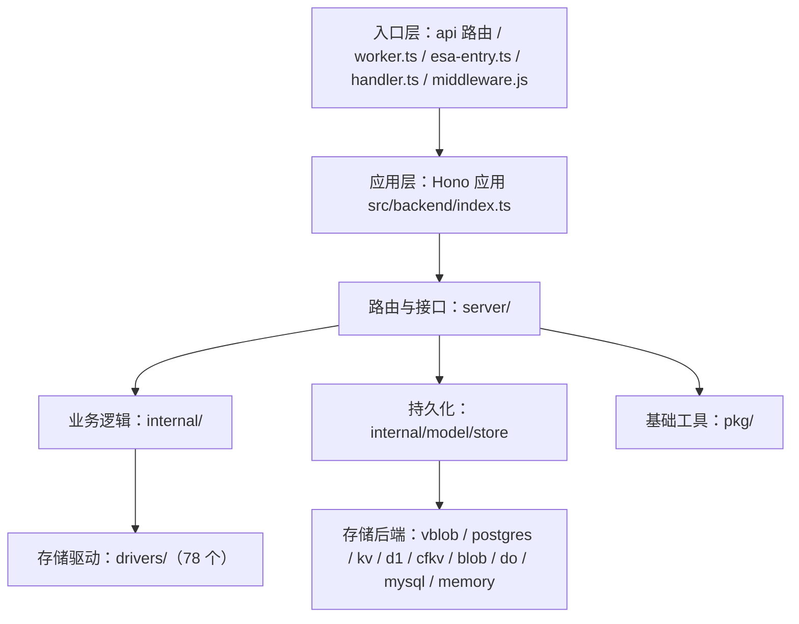

# OpenList-Worker 项目介绍

> 本文是项目定位、架构与设计思路的介绍，不包含部署与使用步骤。

## 一、项目定位

OpenList 是一个多存储聚合的文件列表与管理系统：把分散在不同网盘、对象存储和协议服务中的文件，统一到一个界面中浏览、预览、下载和管理。

本仓库是官方 [OpenListTeam/OpenList](https://github.com/OpenListTeam/OpenList)（Go 版）的 **TypeScript + Serverless 移植版**（仓库名 `openlist-tsworker`，包名 `openlist`，版本 `4.2.3`）。其核心差异在于：

- **后端由 Go 重写为 TypeScript**，运行在边缘计算与 Serverless 运行时上，而不是传统常驻进程；
- **前端保持与官方一致的界面与交互**，复用官方前端产物；
- **同一套后端代码可部署到多个平台**：Cloudflare Workers、腾讯云 EdgeOne Makers、阿里云 ESA、Vercel Serverless，以及 Node.js 容器环境。

目标是让「聚合几十种网盘」这件事尽可能零运维：无需自己维护服务器、进程与反向代理。

## 二、设计目标

- **边缘优先、无服务器**：以请求驱动的方式运行，天然适应冷启动、多实例并发。
- **一套代码、多平台**：抽象出统一入口与存储适配层，部署形态由环境决定。
- **数据可移植**：提供多种存储格式，其中关系表格式与 Go 后端完全同构，可与 Go 版共享同一物理数据库。
- **显式优于隐式**：显式指定的驱动/格式若不可用，直接报错并给出可操作原因，**不静默回退**到其它后端，避免「以为在用 A、实际写进了 B」。
- **安全默认**：JWT 会话、CSRF 防护、点击劫持防护、内容安全策略，以及可插拔的敏感字段落盘加密。

## 三、整体架构

项目按职责分为若干层，自外向内如下：

### 1. 入口层

不同平台各有入口，最终都收敛到同一个 Hono 应用：

- `api/[...route].ts`：Vercel / EdgeOne Node Serverless 入口，导出 `fetch` 风格句柄与各 HTTP 方法句柄；
- `src/backend/worker.ts`：Cloudflare Workers 原生入口；
- `esa-entry.ts`：阿里云 ESA 入口；
- `handler.ts`：通用 Serverless / Node 处理入口；
- 根级 `middleware.js`：EdgeOne Makers 边缘中间件。

### 2. 应用层

`src/backend/index.ts` 负责装配 Hono 应用、合并运行时环境变量、挂载全部后端路由，并提供 SPA 回退壳，使前端深链（如 `/add`、`/@manage/*`）在前端资源不存在的路径上仍能正确落到单页应用。

### 3. 路由与接口层（`src/backend/server/`）

按领域拆分的 HTTP 接口与中间件，主要包括：

- 通用：`router.ts`（路由汇总、`/health` 存活探针、`/healthz` 就绪探针）、`middlewares.ts`（鉴权、Cron Bearer、限流等）；
- 鉴权与账户：`auth.ts`、`sso.ts`、`ldap.ts`、`public.ts`（初始化与公开诊断）；
- 文件与共享：`fs.ts`、`raw.ts`、`share.ts`、`task.ts`；
- 管理：`admin.ts`；
- 对外协议：`webdav`、`s3.ts`、`mcp.ts`；
- 代理与静态资源：`proxy_request.ts`、`assets.ts`、`debug.ts`。

### 4. 业务内部层（`src/backend/internal/`）

与 HTTP 无关的领域逻辑，包括 `driver`（驱动注册与解析）、`model`（数据模型与持久化）、`op`（文件操作原语）、`stream`、`upload`、`webdav`、`mcp`、`archive`、`seed`。

### 5. 基础工具层（`src/backend/pkg/`）

跨模块复用的底层能力：`crypto` / `legacy-ciphers` / `chacha20`（加密与算法）、`csrf`、`totp`、`password`、`permission`、`path`、`sign`（签名与签名链接）、`xml`、`stream`、`http`、`errs`（错误脱敏）、`audit`、`secure-log` 等。

## 四、存储与持久化

### 存储格式（`DB_FORMAT`）

- `map`：整对象 JSON，适合 KV / Blob 等简单存储；
- `key`：按实体拆分为多条记录，避免单个大 JSON；
- `sql`：关系表格式，**表结构与命名与 Go 后端一致**（snake_case + 复数 + `x_` 前缀，如 `x_storages`、`x_users`、`x_setting_items`），因此可与 Go 版共享同一物理数据库。

### 存储驱动（`DB_DRIVER`）

后端抽象出统一的存储接口，并内置一批实现：

- 边缘/云存储：EdgeOne Blob、ESA Blob、Vercel Blob（`vblob`）、Cloudflare KV（binding 与 REST API 两种）、Cloudflare D1、Cloudflare Durable Objects；
- 关系数据库：MySQL、MariaDB、PostgreSQL（含 Vercel Marketplace / Neon 的 HTTP 驱动）；
- 内存驱动：仅用于无持久化后端的降级场景。

默认 `auto` 按固定优先级探测可用驱动；显式指定驱动时不回退，不可用即拒绝并说明原因，`env_check` / `init_status` 会回显当前生效配置与修复建议。

### 敏感字段加密（`DB_CIPHER`）

- 默认 `none`，可显式启用多种算法（AES-256-GCM、ChaCha20-Poly1305、AES-CBC-HMAC 等，另有仅用于兼容的 DES/3DES）；
- 密文带版本前缀（`enc:v1:` ~ `enc:v6:`），**读取时按前缀自动识别算法**，因此切换算法或关闭加密都不会使既有数据不可读，并在下次保存时逐字段迁移；
- 密钥派生结果在进程内缓存，未变化字段跳过重新加密，避免「改一个设置触发全库重写」，对昂贵算法尤为明显。

> 说明：即使 `DB_CIPHER=none`，JWT 令牌签名仍需要一把跨实例一致的共享密钥；未通过环境变量提供时，安装向导会生成并持久化该密钥。

## 五、存储驱动生态

项目内置 **78 个存储驱动**，覆盖主流网盘、对象存储、协议服务与网盘程序，并额外提供若干虚拟/功能型驱动：

- **虚拟/功能型**：`Local`、`Alias`、`UrlTree`、`AutoIndex`、`Strm`、`Crypt`、`Virtual`、`Chunk` 等，用于本地挂载、地址别名、URL 列表、加密存储与分片。

驱动之间通过统一接口对接上层文件操作，新增驱动只需实现该接口并在注册表登记。

## 六、核心能力

- **文件浏览与预览**：统一目录树，支持图片、视频、音频、文档、代码、压缩包等在线预览；
- **上传与下载**：跨存储上传、批量下载、流式传输与直链跳转；
- **文件分享**：带有效期、密码与权限控制的分享链接，支持匿名访问与目录分享；
- **搜索**：在已索引存储中检索文件；
- **离线任务**：后台任务队列，支持批量与异步处理；
- **对外协议**：`WebDAV` 与 S3 兼容端点，便于挂载到第三方工具；
- **MCP 服务**：提供 Model Context Protocol 端点，可被 AI 助手等客户端集成。

## 七、权限与安全

- **访问控制**：基于角色的 RBAC，支持用户分组、目录级读写权限与配额；
- **认证方式**：内置账号密码，支持 TOTP 二次验证、WebAuthn/FIDO 登录、SSO 单点登录与 LDAP 目录认证；
- **加固项**：JWT 会话、CSRF 防护、点击劫持防护（`X-Frame-Options`）、内容安全策略（CSP）；
- **可观测性**：`/health` 存活探针与 `/healthz` 就绪探针，用于监控与告警；就绪探针会基于**实际生效的存储驱动**判断持久化是否可用。

## 八、前端

- **框架**：React 19 + TypeScript；
- **UI**：Ant Design / Material-UI；
- **构建**：Vite；
- **形态**：单页应用，配合后端 SPA 回退，保证前端路由深链可用。

## 九、多平台部署形态

后端不绑定单一平台，同一套代码以不同入口适配多种运行环境：

- **Cloudflare Workers**：原生 `fetch` 入口，使用 D1 / KV 等绑定；
- **腾讯云 EdgeOne Makers**：Node Serverless 入口 + 根级边缘中间件；
- **阿里云 ESA**：专用入口；
- **Vercel Serverless（含 Hobby）**：Node Runtime 入口，使用平台自带 Blob / Postgres 持久化；受免费层限制影响，Cron 频率与代理请求体大小需相应降级（大文件代理自动转为 302 直链）；
- **Serverless / Node.js 容器**：通用处理器与容器启动脚本。

## 十、工程与质量

- **构建**：`pnpm build` 先拉取官方前端产物，再由脚本产出各平台所需的构建产物；
- **测试**：基于 Node 内置 test runner（`tsx --test`），按驱动、服务端、存储、模型等分模块执行，另有回归脚本；
- **静态检查**：`pnpm lint` 使用 `tsc --noEmit` 全量类型检查；`pnpm format` 使用 Prettier。

## 十一、版本与许可

- 当前版本：`4.2.3`；
- 许可证：**AGPL-3.0**；
- 上游与致谢：基于 [Alist](https://github.com/AlistGo/alist) 与 [OpenListTeam/OpenList](https://github.com/OpenListTeam/OpenList) 演化而来，感谢其作者与全体贡献者。
